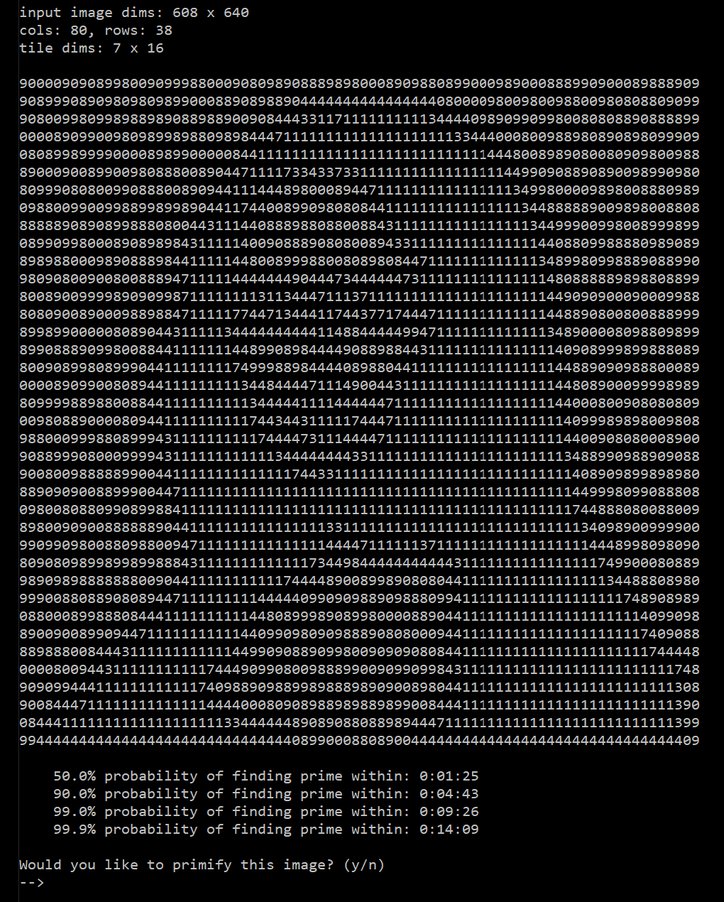
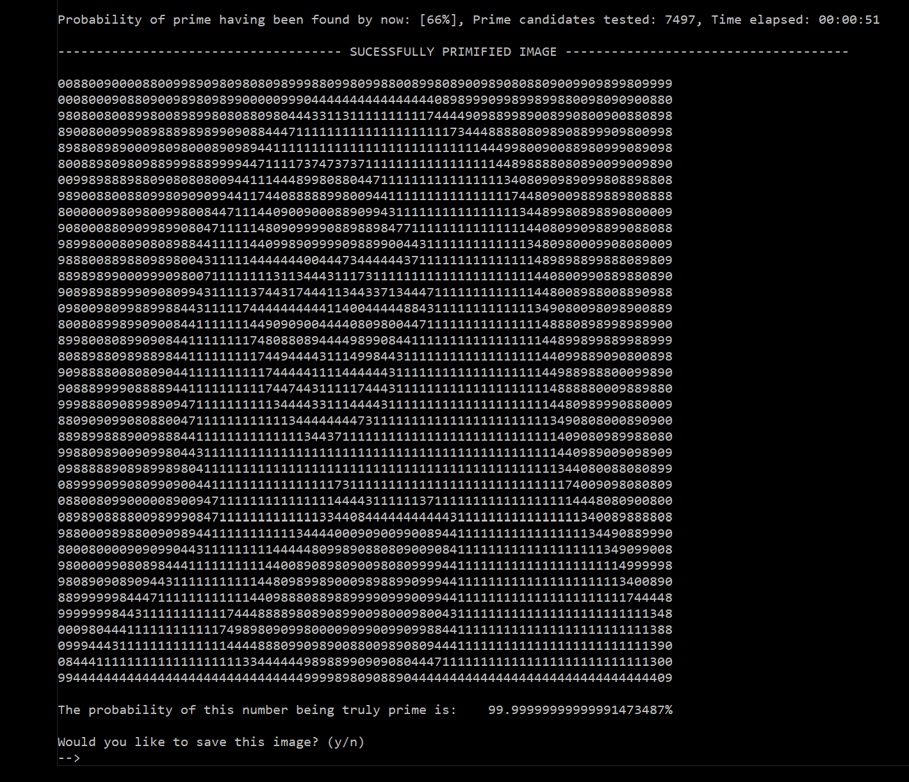
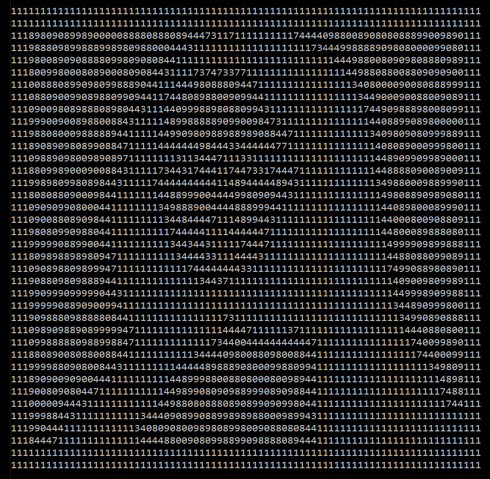
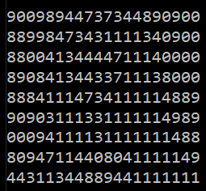
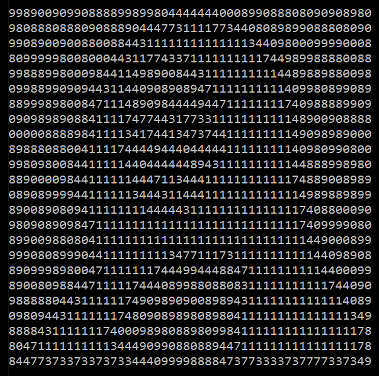
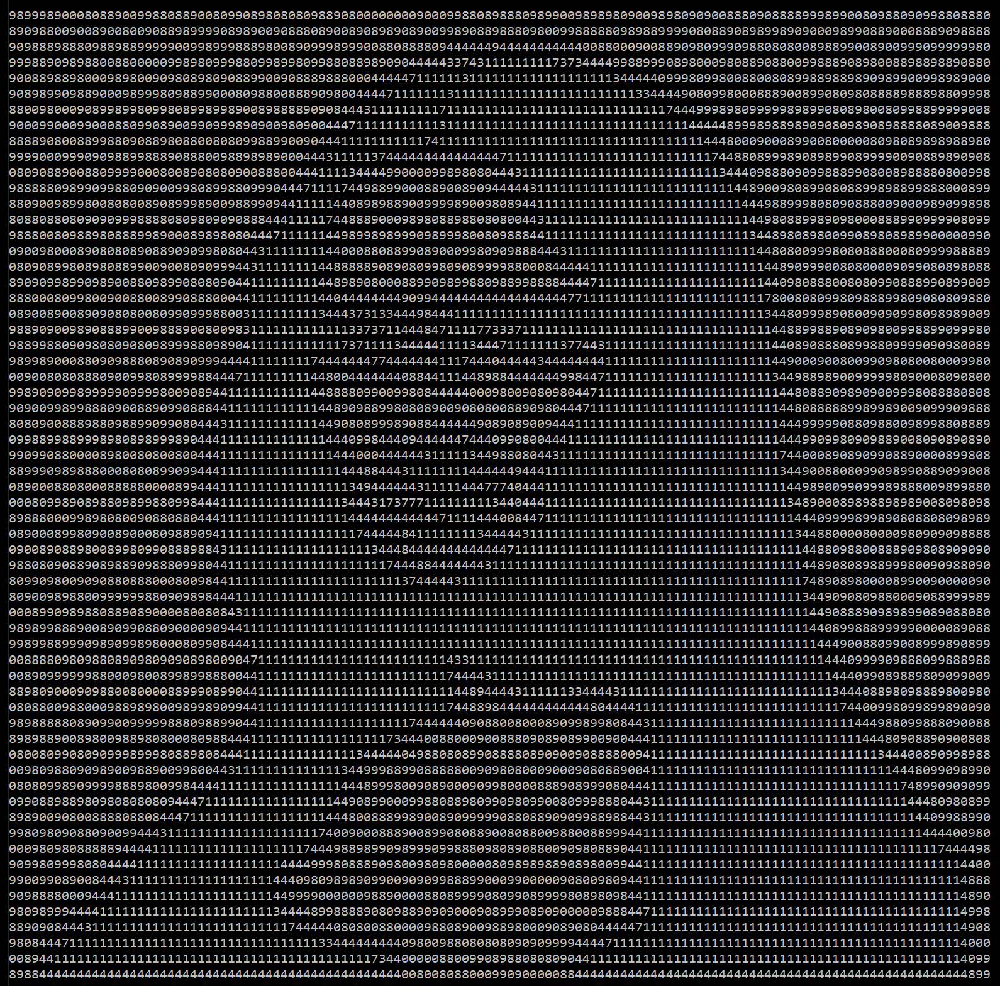
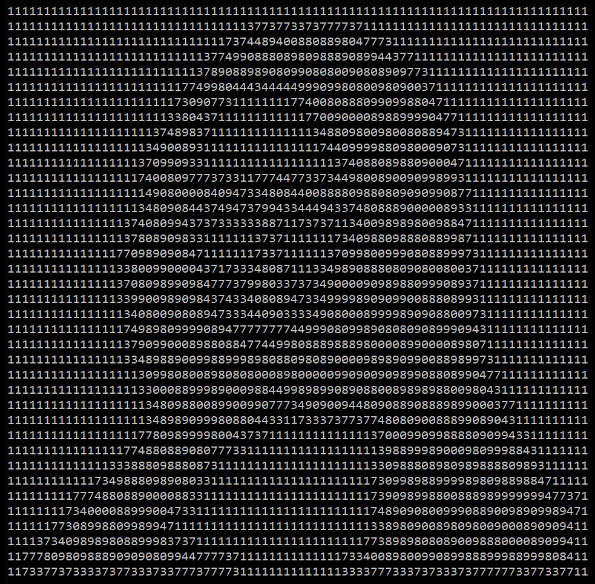
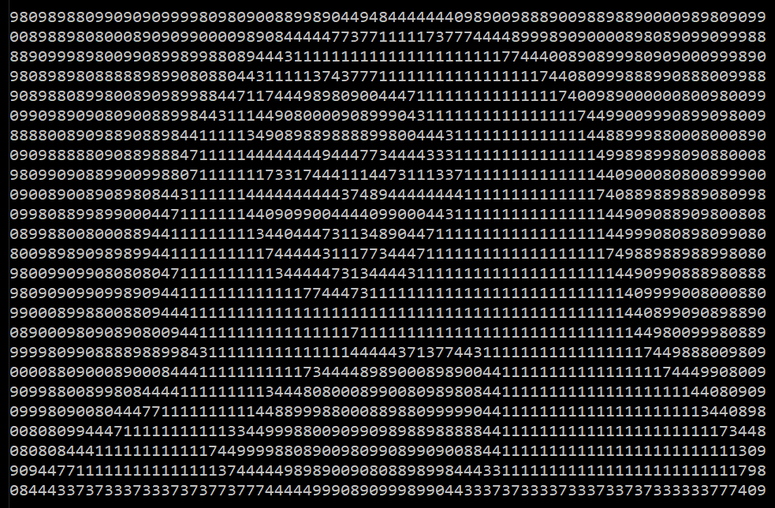
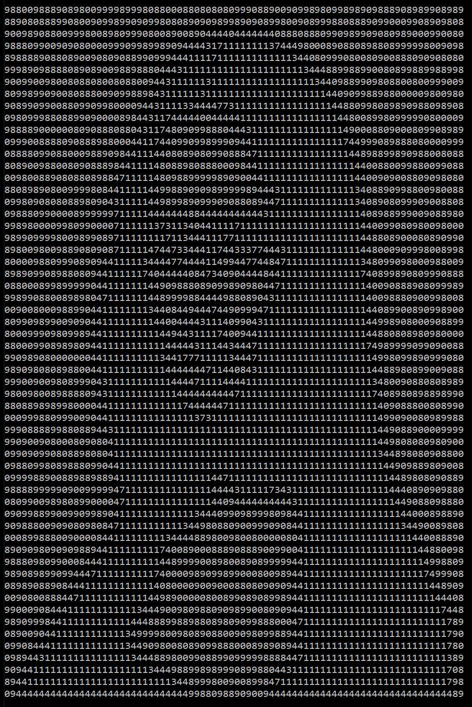

<p align="center">
  
</p>

# asciiPrime
Converts images into numerical ascii art which is also a prime number. Primality is checked using the Rabin-Miller Strong Pseudoprime Test, as shown in section 4.5.4 algorithm P of Donald E. Knuth's “The Art of Computer Programming”, volume 2

# Usage Instructions
We will first need an image to convert to into an AsciiPrime. The program can handle any standard _.png_ or _.jpg_, but for now it will only desaturate it and not do a particularly good job of posterising it. Thus it is recommended to start with images that already have a lot of contrast and lots of fully black and fully white sections. 

A good example would be the following:

<p align="center">
  
</p>

To convert this image into a prime we run the command
```bash
  python3 asciiPrime.py --file images/mona.jpg 
```
The program will now display a sample ascii image, that is _not yet a prime number_. This image serves simply as a sample of what the result will roughly look like. Additionally, the program will display estimates of computation together with the confidence level at which that estimate is realised.

<p align="center">
  
</p>

Responding with `--> y` will proceed with the computation, by the end of which a primified version of the above image will be shown.
<p align="center">
  
</p>

The user is now asked if they would like to save the result. If they respond with `--> y` the program will save the image to a .txt file, both in its rectangular and in continues string form. Aditionally some statistics about the image, like its size will also be saved.

## Customising the image
When running the initial command there are various optional parameters that can be set. 

For example a border can be added to the image, by setting the `--borderWidth` parameter to a value greater than 0.

```bash
  python3 asciiPrime.py --file images/mona.jpg --borderWidth 3
```
<p align="center">
  
</p>

The digit used for the border can be changed using the `--borderChar` parameter.

One can vary the number of columns, or the width of the image using the `--cols` parameter. Setting this parameter to the values `30` or `50` and `130` results in the following images:
```bash
  python3 asciiPrime.py --file images/mona.jpg --cols 130
```
<p align="center">
  
  
  
</p>

If one prefers an inverted version of the image, they can use the `--invert` parameter. This is ideal for a black font on a white background

```bash
  python3 asciiPrime.py --file images/mona.jpg --invert
```

<p align="center">
  
</p>

The `--autoSave` parameter automatically confirms the message asking for the primified image to be saved. This may be useful for longer computation.

And Finally the `--scale` parameter allows you to set the vertical scaling of the image, as this can change depending on the font used. The default is `0.46`. Smaller numbers lead to a more squashed image

```bash
  python3 asciiPrime.py --file images/mona.jpg --scale 0.3
```
<p align="center">
  
</p>

and larger numbers lead to a more stretched image

```bash
  python3 asciiPrime.py --file images/mona.jpg --scale 0.7
```
<p align="center">
  
</p>

# Installation and Setup
This guide is for the setup of _asciiPrime_ in Ubuntu via WSL.
It is assumed you have 
- Python3, pip3
- The python packages _numpy_ and _pillow_
- gcc (c - compiler)

```bash
  python3 asciiPrime.py --file images/mona.jpg --scale 0.5
```


# Installation and Setup
This guide is for the setup of _asciiPrime_ in Ubuntu via WSL.
It is assumed you have 
- Python3, pip3
- The python packages _numpy_ and _pillow_
- gcc (c - compiler)

already installed.

## Downloading source code
Navigate to the directory which should contain _asciiPrime_, then clone the git repository using
```bash
    git clone https://github.com/benjaminorthner/asciiPrime.git
```
This should set up a new folder _asciiPrime_ containing the source code


## Installing GMP Library
In order to achieve reasonable speeds, we will use C to perform the primality checks. Because we are dealing with integers bigger than 64 bits we use the GNU Multiple Precision Arithmetic Library GMP. It just so happens to already contain an implementation of the Rabin-Miller Pseudoprime test, so we can avoid reimplementing this ourselves aswell. This C function is called within a python script using _ctypes_.

In order to install GMP, you must first download it's latest release from the [GMP website](https://www.gmplib.org/#DOWNLOAD). Or alternatively use the following command within a folder of your choosing
```bash
  wget https://gmplib.org/download/gmp/gmp-6.2.1.tar.lz
```
Now unpack the downloaded file and navigate into it using
```bash
  sudo apt-get install lzip
  tar --lzip -xvf gmp-6.2.1.tar.lz
  rm -f gmp-6.2.1.tar.lz
  cd gmp-6.2.1
```
From here we use the GMP auto installer. Before we do that we must make sure our system is up to date with
```bash
  sudo apt-get update -y
  sudo apt-get upgrade -y
```
In order to create the autoinstaller makefile we must first run the configuratorm which itself requires the installation of _m4_
```bash
  sudo apt-get install m4
  ./configure
```

Then we can run the GMP installer and additionally run a check using
```bash
  sudo make install
  sudo make check
```
Even if the check fails, the code may still run without issues.

After verifying that the code runs you can delete the gmp-6.2.1 folder using
```bash
  cd ..
  sudo rm -rf gmp-6.2.1
```

## Compiling the C code
To compile the C code so that it can be used by the python wrapper function simply use
```bash
  make primify
```

# Theory

## Rabin-Miller Pseudoprimality test
Work in Progress. For now see [Wikipedia](https://en.wikipedia.org/wiki/Miller%E2%80%93Rabin_primality_test)

## Estimation of calculation duration
Stupid Github Markdown does not support Latex... so ignore this for now.


The prime counting function, which for any positive integer x gives a fairly good estimate of the number of primes below x is given by$$\pi(x) = \frac{x}{\ln(x)}$$

We would like to know the probability is of any particular reconfiguration of our ascii image being prime. If our ascii image has $p$ digits, then we can assume that our possible primes will be in between $x=10^{p+1}$ and $x=10^p$.

So the probability $P$ of any ascii image with $p$ digits being prime is
$$ P(p) = \frac{\pi(10^{p+1}) - \pi(10^p)}{10^{p+1} - 10^p} = \frac{9p - 1}{9p(p+1)\ln(10)}$$
Because our code only ever checks odd numbered ascii images the probability of finding a prime is twice as large and

$$P(p) = \frac{2(9p - 1)}{9p(p+1)\ln(10)}$$

Thus the probability $S$ of finding a prime after $n$ trails is given by
$$ S = 1 - (1 - P(p))^n$$
Which when solved for n gives, the number of trails necessary to find a prime ascii image with $p$ digits with a probability of $S$
$$n(p,S) = \frac{\ln(1-S)}{\ln(1-P(p))}$$

This is then multiplied with the average duration of 1 primality test to give the estimated computation times.
